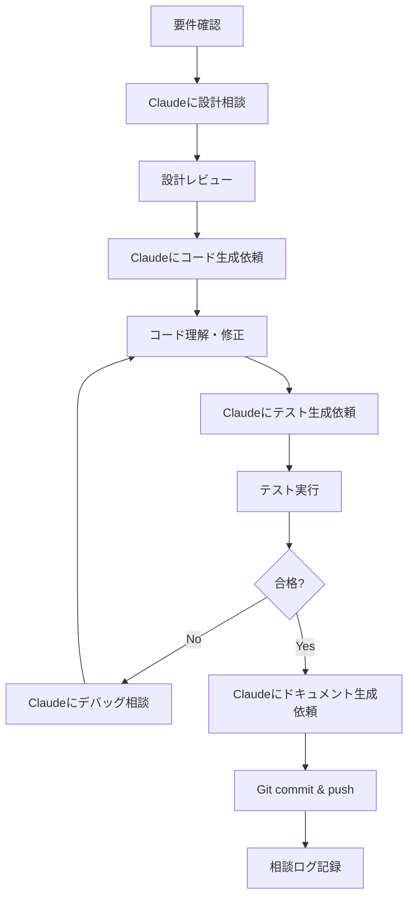

# 🤖 AI協働開発ガイド

このドキュメントは、Claude（Anthropic AI）を活用してMemoripassを開発するためのガイドです。

---

## 目次

1. [基本方針](#基本方針)
2. [開発フロー](#開発フロー)
3. [Claudeへの効果的な質問方法](#claudeへの効果的な質問方法)
4. [相談ログの記録方法](#相談ログの記録方法)
5. [ベストプラクティス](#ベストプラクティス)

---

## 基本方針

### AI活用の目的

1. **開発速度の向上** - ボイラープレートコードの自動生成
2. **品質の向上** - セキュリティレビュー、ベストプラクティスの提案
3. **学習の促進** - 技術的な質問への即座の回答
4. **ドキュメント整備** - コードと同時にドキュメント生成

### ⚠️ 重要な原則

- **盲目的なコピペ禁止**: 必ずコードを理解してから使用
- **セキュリティは人間が最終確認**: AIの提案も疑う姿勢を持つ
- **テストは必須**: AI生成コードも必ずテストを書く
- **ドキュメント化**: AI相談の内容は必ず記録

---

## 開発フロー

### 典型的な開発サイクル



---

## Claudeへの効果的な質問方法

### パターン1: 設計相談

````markdown
# 設計相談テンプレート

## コンテキスト
現在、[機能名]を実装中です。
要件: `docs/requirements/SRS-v2.0.md` の [要件ID] を参照

## 質問
[具体的な質問]

## 制約条件
- Android 15 (API Level 35)
- セキュリティ要件: [具体的な要件]

## 期待する回答
- クラス構成
- サンプルコード
- セキュリティ考慮点
````

**実例**:
````
## コンテキスト
現在、生体認証機能（FR-AUTH-01）を実装中です。

## 質問
BiometricPromptを使った実装で、以下を実現したい:
1. 指紋/顔認証の両方に対応
2. 失敗時のPINフォールバック
3. バックグラウンド復帰時の再認証

クラス設計とサンプルコードを提案してください。

## 制約条件
- Android 15 (API Level 35)
- StrongBox Keystore使用必須
- テスタブルな設計

## 期待する回答
- AuthenticationManagerクラスの設計
- BiometricPromptの実装例
- エラーハンドリング方法
````

---

### パターン2: コード生成

````markdown
# コード生成テンプレート

## 要件
[要件IDと概要]

## 仕様
[詳細な仕様]

## 出力形式
```java
package [パッケージ名];
// ここにコード生成
```

## 追加要求
- Javadocコメント必須
- ユニットテストも生成
- エラーハンドリング含む
````

**実例**:
````
## 要件
FR-SEC-01: パスワード生成機能

## 仕様
- 長さ: 8-64文字（可変）
- 文字種: 英大/小/数字/記号（個別ON/OFF）
- SecureRandom使用
- エントロピー128bit以上

## 出力形式
```java
package com.memoripass.util;

public class PasswordGenerator {
    // コード生成
}
```

## 追加要求
- Builder パターンで実装
- 完全なJavadoc
- JUnit テストも生成
````

---

### パターン3: セキュリティレビュー

````markdown
# セキュリティレビューテンプレート

## レビュー対象
[クラス名/ファイル名]

## レビュー観点
1. OWASP Mobile Top 10
2. メモリ安全性
3. 例外処理
4. Android Best Practices

## コード
```java
[ここにコードを貼り付け]
```

## 特に確認したい点
[具体的な懸念点]
````

---

### パターン4: デバッグ支援

````markdown
# デバッグ支援テンプレート

## 症状
[問題の説明]

## エラーログ
```
[エラーメッセージ]
```

## 環境
- デバイス: [機種名]
- Android: [バージョン]
- ビルド: [Debug/Release]

## 該当コード
```java
[問題のコード]
```

## 試したこと
1. [試したこと1]
2. [試したこと2]

## 質問
原因と修正方法を教えてください。
````

---

## 相談ログの記録方法

### ファイル名規則

```
docs/ai-sessions/YYYY-MM-DD-[トピック].md
```

例:
- `2026-02-01-biometric-auth-design.md`
- `2026-02-05-encryption-implementation.md`
- `2026-02-10-ui-layout-review.md`

### テンプレート

````markdown
# AI相談セッション: [トピック]

**日時**: YYYY-MM-DD  
**相談者**: [あなたの名前]  
**AI**: Claude Sonnet 4.5  
**関連要件**: [FR-XXX-XX]

---

## 相談内容

### 質問
[質問内容をコピー]

### Claudeの回答
[回答をコピー]

### 採用した方針
- [決定事項1]
- [決定事項2]

### 不採用とした提案
- [理由とともに記録]

---

## 実装への反映

### 変更ファイル
- `src/main/java/com/memoripass/[パス]/[ファイル名].java`

### コミット
- コミットハッシュ: `abc1234`
- コミットメッセージ: `feat: ...`

---

## 学んだこと

### 技術的な学び
- [学んだこと1]
- [学んだこと2]

### ベストプラクティス
- [プラクティス1]
- [プラクティス2]

---

## 残課題

- [ ] [課題1]
- [ ] [課題2]

---

## 次のステップ

次回相談予定: YYYY-MM-DD  
トピック: [次のトピック]
````

---

## ベストプラクティス

### ✅ 推奨される使い方

#### 1. 段階的な質問
```
❌ 悪い例:
「Memoripassを完全に実装してください」

✅ 良い例:
「まずBiometricPromptの初期化部分の実装を提案してください。
次のステップで認証コールバックの処理を相談します」
```

#### 2. コンテキストの明示
```
❌ 悪い例:
「このコード、動きません」

✅ 良い例:
「FR-AUTH-01の生体認証実装で、以下のエラーが出ます。
要件定義は docs/requirements/SRS-v2.0.md の該当セクション参照。
環境: Pixel 9, Android 15
エラー: [エラーログ]」
```

#### 3. 学習を重視
```
❌ 悪い例:
コードをもらってそのままコピペ

✅ 良い例:
「このコードの特に〇〇の部分について、なぜこの実装が
セキュリティ上優れているのか説明してください」
```

#### 4. レビューの活用
```
実装後:
「先ほど生成したコードを、OWASP Mobile Top 10の観点で
レビューしてください。特にM2（不適切な暗号化）とM9（リバース
エンジニアリング）の観点でチェックをお願いします」
```

---

### ⚠️ 避けるべき使い方

#### 1. 丸投げ
```
❌ 「パスワードマネージャーを作ってください」
→ 自分で要件を理解せず、全部任せる
```

#### 2. 盲目的な信頼
```
❌ AIの提案をそのまま本番環境に投入
→ 必ず理解し、テストし、レビューする
```

#### 3. セキュリティの軽視
```
❌ 「セキュリティは後で考えます。まず動くものを」
→ セキュリティは最初から組み込む
```

#### 4. ドキュメント化の省略
```
❌ 相談内容を記録せず、次に同じ質問をする
→ 必ずログに残して後から参照できるようにする
```

---

## 具体的な活用例

### 例1: 新機能実装の流れ

#### Step 1: 要件確認
```
私: 「FR-AUTH-01の要件を確認したいです。
docs/requirements/SRS-v2.0.md の該当部分を要約して、
実装時の注意点を教えてください」
```

#### Step 2: 設計相談
```
私: 「要件を踏まえて、AuthenticationManagerクラスの設計を
提案してください。以下の点を考慮:
- テスタビリティ
- Dependency Injection対応
- ライフサイクル管理」
```

#### Step 3: 実装
```
私: 「提案された設計で、完全な実装コードを生成してください。
Javadocと、想定されるエッジケースへの対応も含めて」
```

#### Step 4: レビュー
```
私: 「生成されたコードをセキュリティレビューしてください:
1. 生体認証のセキュリティクラスは適切か
2. フォールバック処理に脆弱性はないか
3. メモリ管理は適切か」
```

#### Step 5: テスト
```
私: 「このクラスの包括的なJUnitテストを生成してください:
- 正常系テスト
- 異常系テスト
- セキュリティテスト
モックはMockitoを使用」
```

#### Step 6: ドキュメント
```
私: 「この実装を README.md のセットアップセクションに
追加する文章を生成してください。コード例付きで」
```

---

### 例2: バグ修正の流れ

#### Step 1: 問題の報告
```
私: 「生体認証ダイアログが表示されません。
エラーログ: [ログ]
環境: Pixel 9, Android 15
該当コード: [コード]

考えられる原因を3つ挙げて、それぞれの確認方法を教えてください」
```

#### Step 2: 原因調査
```
Claude: 「原因候補:
1. 権限不足 → AndroidManifest確認
2. ...」

私: 「1を確認したところ、USE_BIOMETRIC権限はあります。
2の可能性について、具体的なデバッグ方法を教えてください」
```

#### Step 3: 修正実装
```
私: 「原因が特定できました（〇〇でした）。
修正コードを提案してください。併せて、
今後同じ問題を防ぐためのチェックリストも作成してください」
```

---

## プロンプト集の活用

### 再利用可能なプロンプトファイル

プロジェクトの `prompts/` ディレクトリに保存:

- `prompts/code-review.md` - コードレビュー用
- `prompts/unit-test-generation.md` - テスト生成用
- `prompts/security-check.md` - セキュリティチェック用
- `prompts/documentation.md` - ドキュメント生成用

これらをコピーして、具体的なコードやコンテキストを埋めて使用。

---

## 相談ログの整理

### 月次レビュー

毎月末に、その月の相談ログを振り返る:

```markdown
# 2026年2月の学び

## 技術的な学び
- StrongBox Keystoreの使用方法
- BiometricPromptのライフサイクル管理
- GCMモードの正しいIV生成

## よく聞いた質問TOP3
1. 暗号化実装のベストプラクティス
2. エラーハンドリング方法
3. テストのモック作成

## 改善できた点
- セキュリティレビューを必ず実施するようになった
- テストカバレッジが向上（60% → 85%）

## 次月の目標
- UI/UX設計でもっとClaudeを活用
- パフォーマンスチューニングの相談
```

---

## まとめ

### Claude活用の黄金律

1. **具体的に質問する** - コンテキストを明示
2. **段階的に進める** - 一度に全部を求めない
3. **必ず理解する** - コピペで終わらせない
4. **記録を残す** - 後から見返せるように
5. **レビューを依頼** - AIの提案も疑う

### 開発のリズム

```
朝: 今日のタスク確認 → Claudeに設計相談
昼: コード実装 → Claudeにレビュー依頼
夕: テスト実装 → Claudeにテスト生成依頼
夜: ドキュメント更新 → 相談ログ記録
```

---

**このガイドを参考に、効率的かつ学習効果の高いAI協働開発を実践してください！**

---

最終更新: 2026年2月1日
