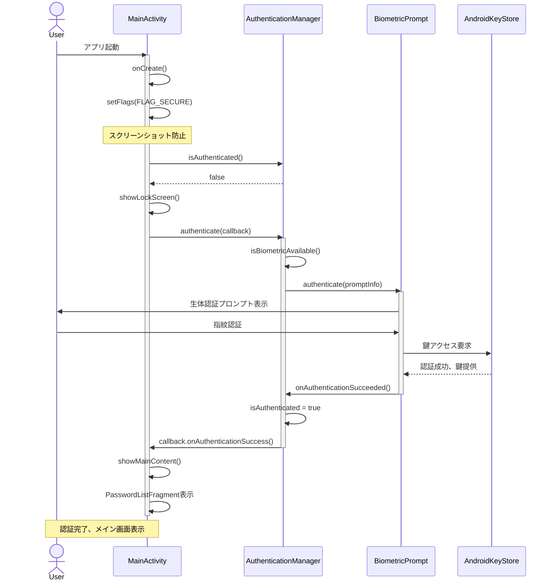
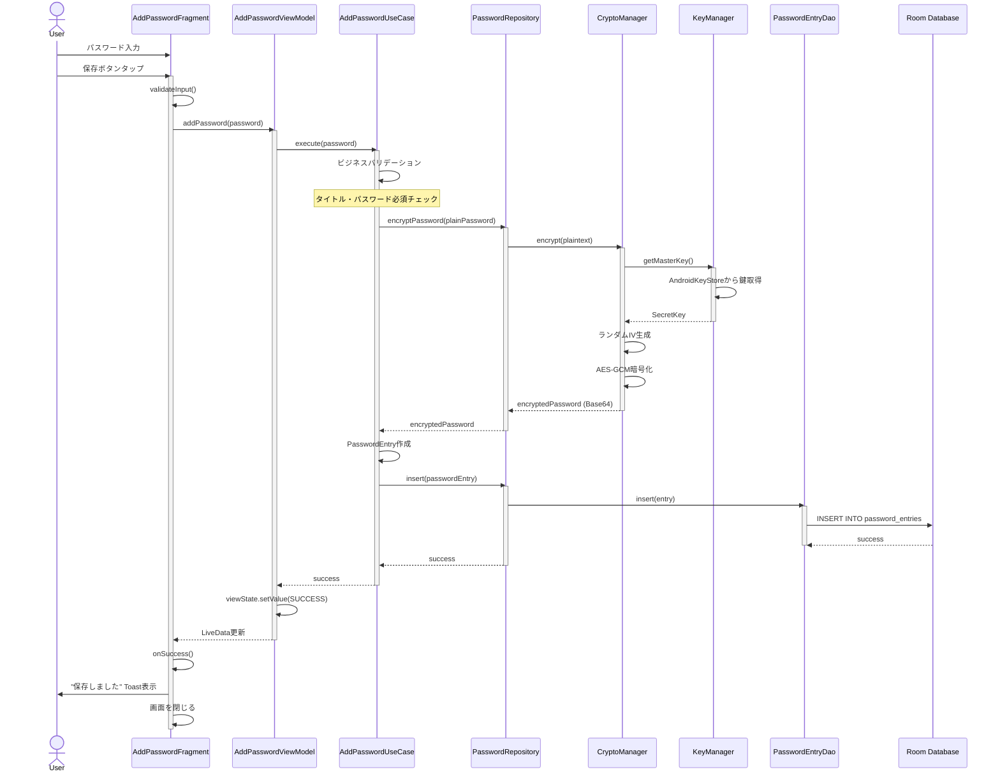
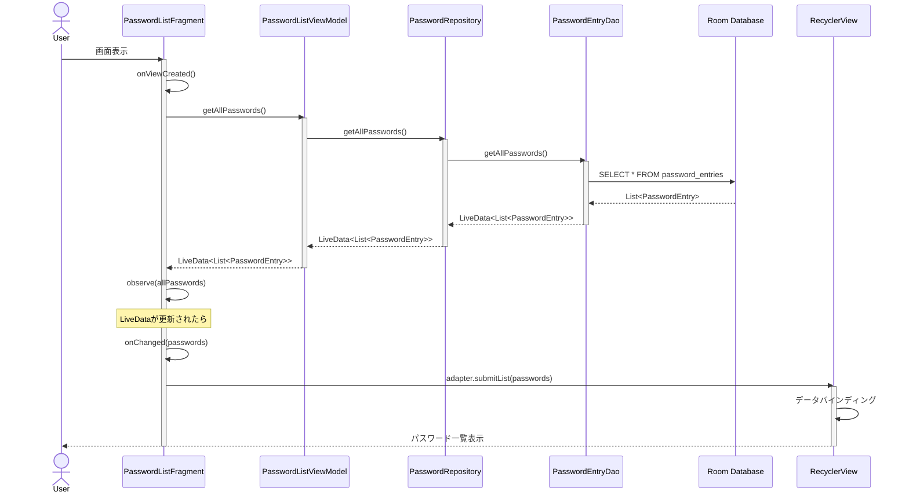
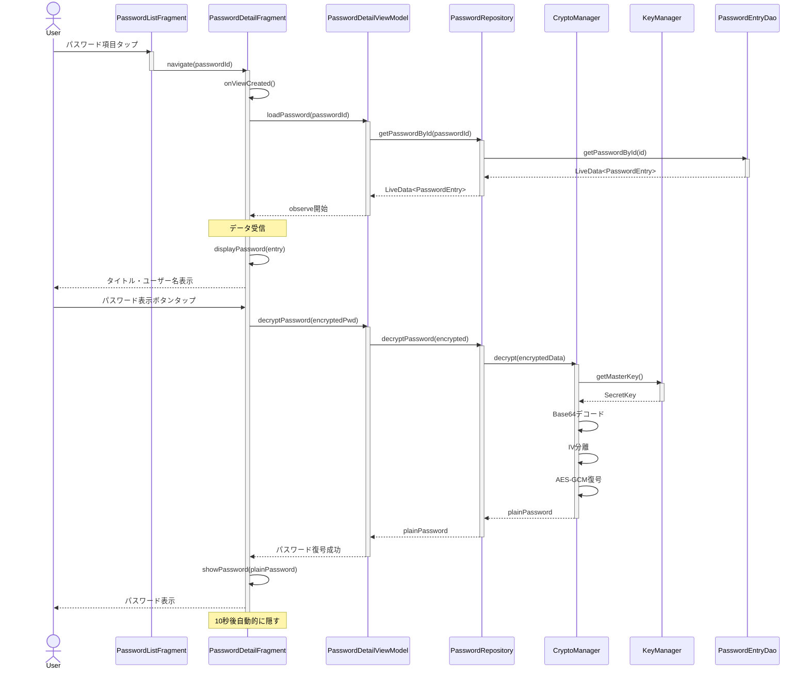
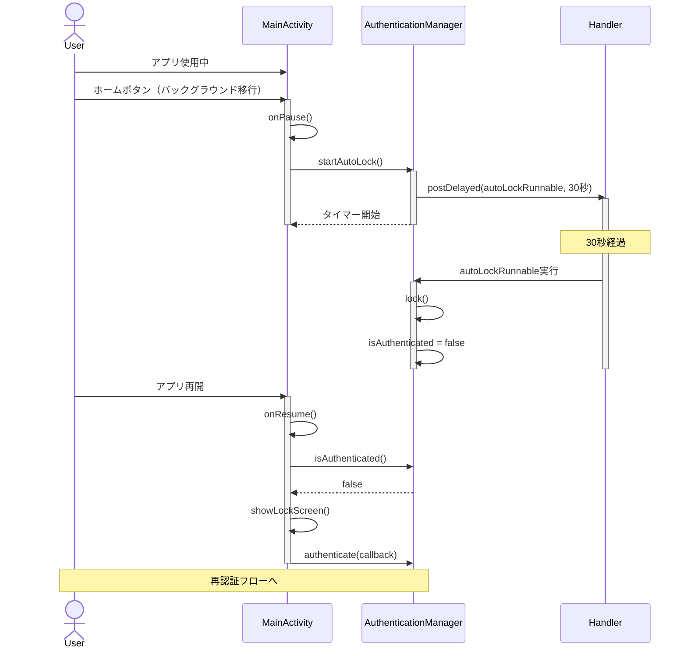
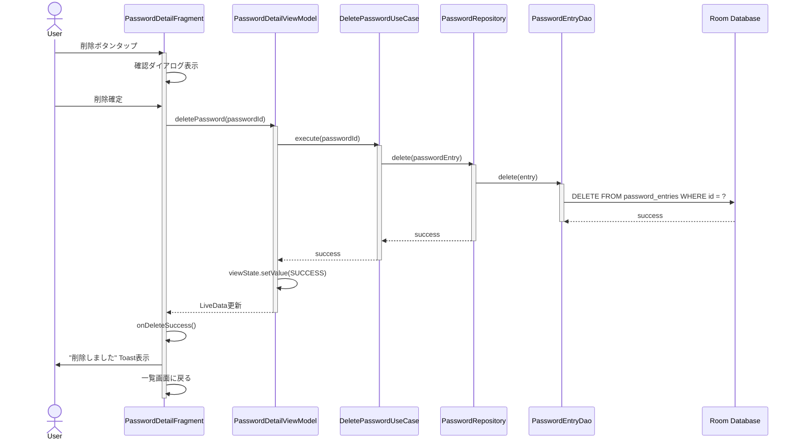
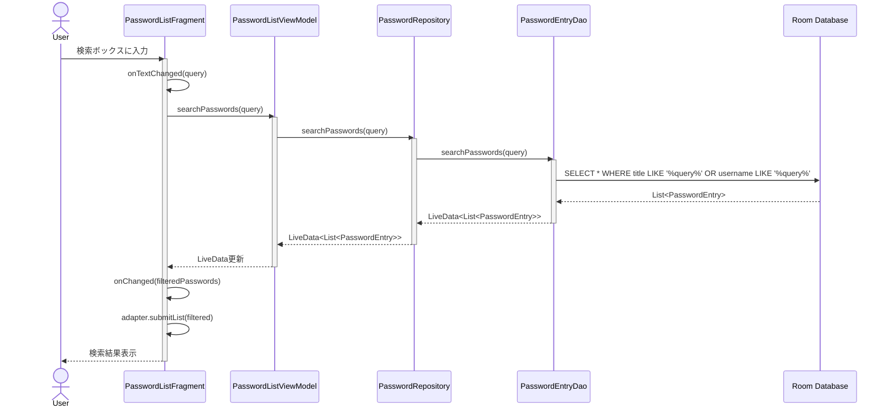

# Memoripass - シーケンス図

## 1. アプリ起動・認証フロー

## 2. パスワード追加フロー

## 3. パスワード一覧取得フロー

## 4. パスワード詳細表示・復号フロー

## 5. オートロックフロー

## 6. パスワード削除フロー

## 7. パスワード検索フロー

---

**作成日**: 2026年2月5日  
**作成者**: Claude + wafukarubonara-stack
